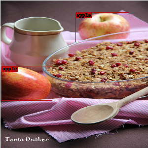
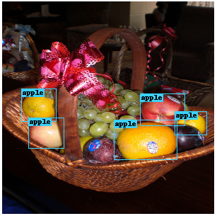

# SSD을 실생활에 적용하기 위한 Fine Tuning
<!DOCTYPE html>
  <head>
  </head>
  <body>
        <a href="https://arxiv.org/abs/1512.02325">SSD</a>는 현재 널리 알려지고 사용되고 있는 Object Detection System 중 하나이다.
         우리는 SSD를 실생활에 적용할 수 있도록 기존에 학습 시간을 대폭 감소시키고, 사용 목적에 맞는 데이터만을 취하는 방법으로 training time 또한 감소시키는 법에 대해 설명하겠다.
          본격적으로 들어가기에 앞서, github에 올리기에는 data의 용량이 너무 크므로 이는 여기에 올리지 않았다. mini-dataset을 만드는 방법은 별도로 coco2 폴더에 python 파일로 저장이 되어있고, 그 외의 dataset은 VOC homepage, COCO homepage를 통해 다운 받을 수 있다.
         또한, 우리는 기존에 SSD에 대해 잘 정리해 놓았던 github 사이트(<a href="https://github.com/amdegroot/ssd.pytorch">amdegroot_SSD</a>)를 참고하였다.
          Datasets
         우리는 우리의 취지에 맞게 COCO dataset 중 일부를 취한 COCO-mini-dataset(apple, orange 각 1,000장)을 생성하였다.
          Parameter
         기존에 IMAGENET dataset을 학습한 VGG16의 parameter를 가져와 사용한 뒤 VOC data를 통해 학습한 SSD를 fine tuning 하였다.
          Testing
          epoch를 약 5k 정도만 했음에도 어느정도는 물체를 잘 찾는 것으로 보인다.
          물체를 잘 찾은 예시와 못찾은 예시 두 가지를 동봉하겠다.
        
        
        train.py 파일을 실행시 학습이 진행되며 /weights 폴더 안에 500iter마다 저장된다.
         
        /coco2 폴더안에는 COCO API를 이용하여 mini-dataset을 만드는 코드 check.py 파일이 저장되어 있다.
  </body>

